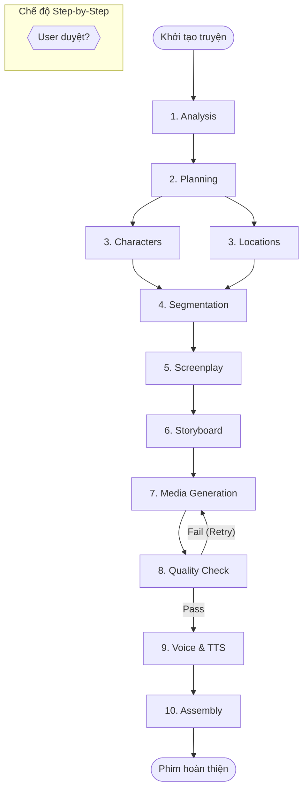

# Tài Liệu Use Case Chi Tiết - WAOO Studio

WAOO Studio là nền tảng sản xuất phim AI sử dụng kiến trúc multi-agent (đa tác nhân) dựa trên giao thức Google A2A. Hệ thống tự động hóa quy trình sản xuất từ văn bản câu chuyện cho đến sản phẩm video hoàn thiện qua 11 giai đoạn.

## 1. Thành phần tham gia (Actors)

### Tác nhân con người (Human Actor)
*   **User/Producer (Người dùng/Nhà sản xuất):** Người cung cấp kịch bản, cấu hình dự án, phê duyệt hoặc chỉnh sửa các kết quả trung gian.

### Tác nhân hệ thống (AI Agents)
*   **Director Agent (Đạo diễn):** Điều phối toàn bộ quy trình, phân tích cốt truyện, lập kế hoạch và phân đoạn.
*   **Character Agent (Nhân vật):** Thiết kế và duy trì tính nhất quán về ngoại hình, tính cách nhân vật.
*   **Location Agent (Bối cảnh):** Thiết kế địa điểm, không gian và bầu không khí của phim.
*   **Storyboard Agent (Phân cảnh):** Lập kế hoạch góc quay, ánh sáng và bố cục cho từng khung hình.
*   **Media Agent (Sản xuất hình ảnh/video):** Chịu trách nhiệm tạo ra các tài sản thị giác và kiểm tra chất lượng.
*   **Voice Agent (Âm thanh):** Thiết kế giọng nói và tạo lời thoại (TTS) cho nhân vật.

---

## 2. Danh sách các Use Case chính

### UC1: Khởi tạo dự án và Cấu hình (Create Project)
*   **Mô tả:** Người dùng bắt đầu một dự án sản xuất phim mới.
*   **Dòng thực hiện:**
    1.  Người dùng nhập nội dung truyện (Novel, Script hoặc Outline).
    2.  Người dùng chọn chế độ thực hiện: **Autopilot** (Tự động hoàn toàn) hoặc **Step-by-Step** (Duyệt từng bước).
    3.  Người dùng thiết lập Ngân sách (Budget) và Mức chất lượng (Quality Level).
    4.  Hệ thống khởi tạo projectId và chuẩn bị môi trường sản xuất.

### UC2: Phân tích cốt truyện và Lập kế hoạch (Analysis & Planning)
*   **Mô tả:** Director Agent phân tích sâu nội dung để lập lộ trình thực hiện.
*   **Dòng thực hiện:**
    1.  **Stage: Analysis:** Phân tích thể loại, cấu trúc (Setup, Conflict, Climax, Resolution) và xác định các thực thể chính.
    2.  **Stage: Planning:** Quyết định chiến lược sản xuất, phân bổ công cụ và mô hình LLM phù hợp (Flash, Standard, Premium).

### UC3: Thiết kế Sáng tạo (Character & Location Design)
*   **Mô tả:** Tạo ra "linh hồn" và không gian cho bộ phim.
*   **Dòng thực hiện:**
    1.  **Stage: Characters:** Character Agent tạo hồ sơ nhân vật (ngoại hình, quần áo, tính cách).
    2.  **Stage: Locations:** Location Agent mô tả chi tiết các địa điểm xuất hiện trong truyện.
    *   *Lưu ý: Hai công đoạn này được chạy song song để tối ưu thời gian.*

### UC4: Chuẩn bị sản xuất (Segmentation & Screenplay)
*   **Mô tả:** Chuyển đổi văn bản thô sang định dạng kỹ thuật.
*   **Dòng thực hiện:**
    1.  **Stage: Segmentation:** Chia nhỏ câu chuyện thành các "clips" độc lập.
    2.  **Stage: Screenplay:** Director chuyển đổi mỗi clip thành kịch bản phân cảnh chi tiết (gồm hành động và thoại).

### UC5: Phân cảnh hình ảnh (Storyboard)
*   **Mô tả:** Storyboard Agent lập kế hoạch thị giác cho từng khung hình.
*   **Dòng thực hiện:**
    1.  Xác định góc quay (Shot type), chuyển động máy ảnh (Camera move).
    2.  Tạo Prompt hình ảnh chi tiết dựa trên thiết kế nhân vật và bối cảnh đã có từ UC3.

### UC6: Sản xuất Media AI (Media Generation)
*   **Mô tả:** Media Agent sử dụng các công cụ AI bên ngoài (FAL, Vidu, MiniMax...) để tạo ra hình ảnh/video.
*   **Dòng thực hiện:**
    1.  Hệ thống gửi yêu cầu sinh ảnh/video hàng loạt (Batch generation).
    2.  Theo dõi trạng thái thông qua cơ chế Polling async.

### UC7: Kiểm định Chất lượng (Quality Check)
*   **Mô tả:** Đánh giá sản phẩm đầu ra bằng LLM.
*   **Dòng thực hiện:**
    1.  Đánh giá trên 4 phương diện: Bố cục, Tính nhất quán, Kỹ thuật và Nội dung truyền tải.
    2.  Nếu điểm dưới 0.7, hệ thống tự động yêu cầu tạo lại (tối đa 2 lần).

### UC8: Sản xuất Âm thanh (Voice & TTS)
*   **Mô tả:** Hoàn thiện phần nghe của bộ phim.
*   **Dòng thực hiện:**
    1.  Voice Agent phân tích giọng nói phù hợp với tính cách nhân vật.
    2.  Tạo âm thanh lời thoại đồng bộ với kịch bản.

### UC9: Lắp ráp thành phẩm (Assembly)
*   **Mô tả:** Tổng hợp tất cả nguyên liệu thành video cuối.
*   **Dòng thực hiện:** Kết hợp Storyboard + Media + Voice để xuất bản phim hoàn chỉnh.

### UC10: Can thiệp và Quản lý (Human-in-the-loop)
*   **Mô tả:** Sử dụng trong chế độ Step-by-Step.
*   **Dòng thực hiện:**
    1.  Hệ thống tạm dừng sau mỗi stage.
    2.  Người dùng kiểm tra kết quả (JSON/Hình ảnh).
    3.  Người dùng có thể yêu cầu "Regenerate" hoặc chỉnh sửa thủ công trước khi bấm "Approve" để sang bước sau.

---

## 3. Sơ đồ quy trình Pipeline

---

## 4. Đặc điểm kỹ thuật nổi bật
*   **Tiered Memory:** Ghi nhớ thông tin nhân vật/bối cảnh qua 3 tầng (Hot - Warm - Cold) để đảm bảo tính nhất quán xuyên suốt bộ phim.
*   **Blackboard Pattern:** Các Agent chia sẻ không gian làm việc chung, cho phép Storyboard Agent "hỏi" Character Agent về ngoại hình nhân vật khi tạo prompt.
*   **Asynchronous Polling:** Xử lý các tác vụ nặng (sinh video) một cách không đồng bộ, không làm nghẽn hệ thống.
